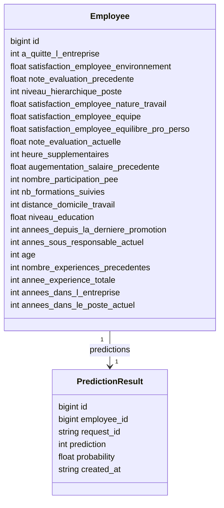

```mermaid
classDiagram
    class Employee {
        bigint id
        int a_quitte_l_entreprise
        float satisfaction_employee_environnement
        float note_evaluation_precedente
        int niveau_hierarchique_poste
        float satisfaction_employee_nature_travail
        float satisfaction_employee_equipe
        float satisfaction_employee_equilibre_pro_perso
        float note_evaluation_actuelle
        int heure_supplementaires
        float augementation_salaire_precedente
        int nombre_participation_pee
        int nb_formations_suivies
        int distance_domicile_travail
        float niveau_education
        int annees_depuis_la_derniere_promotion
        int annes_sous_responsable_actuel
        int age
        int nombre_experiences_precedentes
        int annee_experience_totale
        int annees_dans_l_entreprise
        int annees_dans_le_poste_actuel
    }

    class PredictionResult {
        bigint id
        bigint employee_id
        string request_id
        int prediction
        float probability
        string created_at
    }

    Employee "1" --> "1" PredictionResult : predictions
```